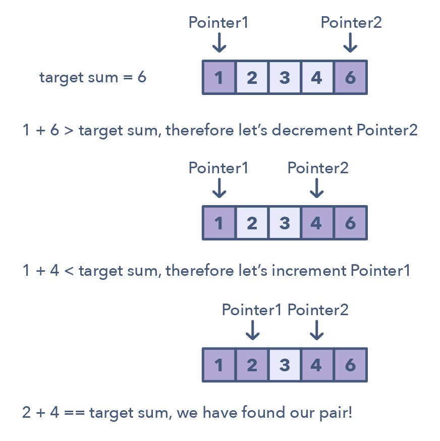

# Two Pointers

In problems where we deal with sorted arrays (or LinkedLists) and need to find a set of elements that fulfill certain constraints, the Two Pointers approach becomes quite useful.

The set of elements could be a pair, a triplet or even a subarray. For example, take a look at the following problem:

> Given an array of sorted numbers and a target sum, find a pair in the array whose sum is equal to the given target.

To solve this problem, we can consider each element one by one (pointed out by the first pointer) and iterate through the remaining elements (pointed out by the second pointer) to find a pair with the given sum. The time complexity of this algorithm will be `O(n^2)` where `‘n’` is the number of elements in the input array.

Given that the input array is sorted, an efficient way would be to start with one pointer in the beginning and another pointer at the end. At every step, we will see if the numbers pointed by the two pointers add up to the target sum. If they do not, we will do one of two things:

1. If the sum of the two numbers pointed by the two pointers is greater than the target sum, this means that we need a pair with a smaller sum. So, to try more pairs, we can decrement the end-pointer.

2. If the sum of the two numbers pointed by the two pointers is smaller than the target sum, this means that we need a pair with a larger sum. So, to try more pairs, we can increment the start-pointer.





## Ways to identify

1.
    - Linked list, array or string.

2.

## Problems

#### [Two Sum](./02.%20Two%20Sum.py)

> Given an array of sorted numbers and a target sum, find a pair in the array whose sum is equal to the given target.

Write a function to return the indices of two numbers (the pair) such that they add up to a target.

Brute force solution: iterate through the array, taking one number at a time, and search for the second number through Binary Search.
The time complexity for this will be `O(n log n)`.

We can follow the **Two Pointers** approach:
1. Start with one pointer at the beginning of the array, and another pointing at the end.

2. At every step, check if the numbers at pointer positions add up to the target sum. If they do, we have found our pair;

3. If the sum of the two numbers pointed by the two pointers is greater than the target sum, we need a pair with a smaller sum. So, to try more pairs, we decrement the end-pointer.

4. If the sum of the two numbers pointed by the two pointers is smaller than the target sum, we need a pair with a larger sum. So, to try more pairs, we increment the start-pointer.

- The time complexity of the above algorithm wil be `O(n)` where `'n'` is the total number of elements in the given array (worse case of the pair of numbers in the middle).

- The algorithm runs in constant space `O(1)`


#### [Remove Duplicates](./03.%20Remove%20duplicates.py)

> Given an array of sorted numbers, remove all duplicates from it. You should not use any extra space; after removing the duplicates in-place return the length of the subarray that has no duplicate in it.

1. In this problem, we need to remove the duplicates in-place such that the resultant length of the array remains sorted.

2. As the input array is sorted, therefore, one way to do this is to shift the elements left whenever we encounter duplicates.

3. In other words, we will keep one pointer for iterating the array and one pointer for placing the next non-duplicate number.

4. So our algorithm will be to iterate the array and whenever we see a non-duplicate number we move it next to the last non-duplicate number we’ve seen.

- The time complexity of the above algorithm will be `O(n)`, where `'n'` is the total number of elements in the given array.

- The algorithm runs in constant space `O(1)`.

#### [Remove Element](./04.%20Remove%20element.py)

> Given an unsorted array of numbers and a target `'key'`, remove all instances of `'key'` in-place and return the new length of the array.

1. In this problem, let the left pointer keep track of the next index to replace. Shift this down by one after every new replacement.

2. The right pointer traverses the array to compare the numbers and see if it matches the target `'key'`. If the value is not `'key'` it should push that number to the front by swapping the position to the left pointer

3. After reaching the end of the array, the result is our left pointer.

- The time complexity of the above algorithm is `O(n)`, where `'n'` is the total number of elements in the given array. This is because we traverse the array once only.

- The algorithm runs in constant space `O(1)`. This is because the array is sorted in-place.

#### [Squaring a Sorted Array](./05.%20Squaring%20a%20sorted%20array.py)

> Given an array of positive numbers and a positive number `‘k’`, find the maximum sum of any contiguous subarray of size `‘k’`.

1. This problem takes advantage of the fact that the array is sorted; therefore, we find the largest absolute value from the ends of the array using a two pointers approach.

2. Square the larger of the two absolute values, then append it to the end of the result array. Shift down the pointers respectively after every iteration until 0 is hit.

3. This results in a sorted array of squared values.

- The time complexity of the above algorithm will be `O(n)` as we are iterating through the input array only once.

- The space complexity of the above algorithm will also be `O(n)`; this space will be used for the output array.

#### [](link)

> Given an array of positive numbers and a positive number `‘k’`, find the maximum sum of any contiguous subarray of size `‘k’`.


#### [](link)

> Given an array of positive numbers and a positive number `‘k’`, find the maximum sum of any contiguous subarray of size `‘k’`.

#### Indepth


```
# Expected output
```
