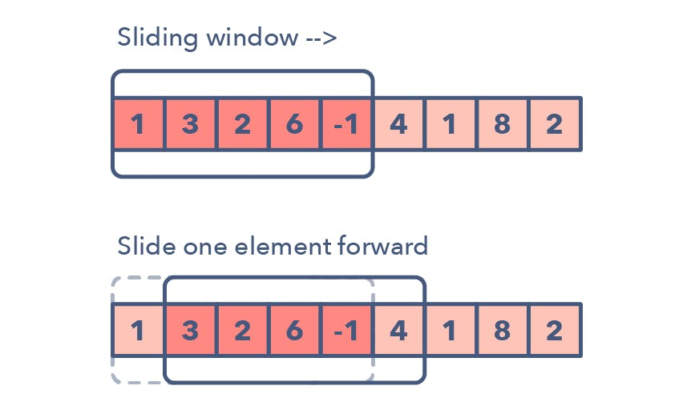

# Queues

A queue is a useful data structure in programming. It is similar to the ticket queue outside a cinema hall, where the first person entering the queue is the first person who gets the ticket.
Queue follows the First In First Out (FIFO) rule - the item that goes in first is the item that comes out first.

In the above image, since 1 was kept in the queue before 2, it is the first to be removed from the queue as well. It follows the FIFO rule.

In programming terms, putting items in the queue is called enqueue, and removing items from the queue is called dequeue.


#### Basic stack operations

A queue is an object (an abstract data structure - ADT) that allows the following operations:

Enqueue: Add an element to the end of the queue
Dequeue: Remove an element from the front of the queue
IsEmpty: Check if the queue is empty
IsFull: Check if the queue is full
Peek: Get the value of the front of the queue without removing it

#### Working of a Stack DS

Queue operations work as follows:

two pointers FRONT and REAR
FRONT track the first element of the queue
REAR track the last element of the queue
initially, set value of FRONT and REAR to -1

#### Enqueue Operation
check if the queue is full
for the first element, set the value of FRONT to 0
increase the REAR index by 1
add the new element in the position pointed to by REAR
#### Dequeue Operation
check if the queue is empty
return the value pointed by FRONT
increase the FRONT index by 1
for the last element, reset the values of FRONT and REAR to -1


#### Implementation

```python
```

#### Limitations of Queue
As you can see in the image below, after a bit of enqueuing and dequeuing, the size of the queue has been reduced.

And we can only add indexes 0 and 1 only when the queue is reset (when all the elements have been dequeued).

After REAR reaches the last index, if we can store extra elements in the empty spaces (0 and 1), we can make use of the empty spaces. This is implemented by a modified queue called the circular queue.

#### Complexity Analysis
The complexity of enqueue and dequeue operations in a queue using an array is O(1). If you use pop(N) in python code, then the complexity might be O(n) depending on the position of the item to be popped.

#### Applications of Queue
CPU scheduling, Disk Scheduling
When data is transferred asynchronously between two processes.The queue is used for synchronization. For example: IO Buffers, pipes, file IO, etc
Handling of interrupts i#### n real-time systems.
Call Center phone systems use Queues to hold people calling them in order.
